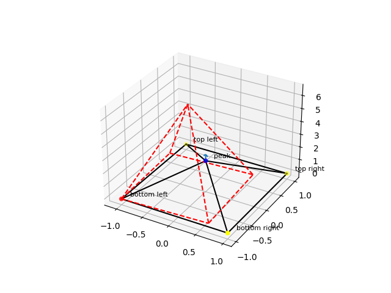

# JANSYS - recTRUSS
*Simple 3d truss structure solver for statically determinate and under-determinate problems.*

recTRUSS is a Python script written by Jan Roth and Luka Distelbrink during the course of TU Delft's 2023 DSE Group 21 -
"MR-TBD".

## Assumptions made by the model
- uniform element properties (constant E, I, A, rho)
- only failures due to yield or Euler buckling
- Euler buckling has K = 1 (pinned joints)
- linear elasticity
- elements only carry axial loads
- forces at joints in the original direction of members
- lumped masses at the points (for vibrations)

## Usage
recTRUSS is used by running it with a single command line argument which specifies what TOML file to read the parameters
from. More important ones are further elaborated on in subsequent subsections. The values to be specified in the
configuration file are:
- `points`: file where points are specified
- `materials`: file where materials are specified
- `natural_bcs`: file where natural boundary conditions are specified
- `numerical_bcs`: file where numerical boundary conditions are specified
- `profiles`: file where profiles are specified
- `connections`: file where connections between points are specified
- `silent`: weather or not there should be any output to STDOUT
- `gravity`: gravitational acceleration
- `show_unsolved`: `true` to show the setup of the problem before solving, `false` to not
- `show_deformed`: `true` to show the solved deformed geometry, `false` to not
- `deformation_scale`: factor by which to scale displacements of points for plotting only
- `show_stresses`: `true` to show stresses in individual elements
- `point_output_destination`: file to save point displacements and reactions to (or "" for STDOUT)
- `element_output_destination`: file to save element stresses (or "" for STDOUT)
- `general_output_destination`: file to save general info, like mass and vibrations (or "" for STDOUT)
- `save_figs`: `true` to save figures as pdf files, `false` to not
- `fig_folder`: folder to save figures to

## Inputs
This section details the input information which is specified in files provided to the program in the configuration file
described in the previous section.

### `points` file
This file defines points used for geometry. The file itself has the format of a comma separated value (CSV) file. Each 
row of the file specifies an individual point. Values which need to be specified are:
- `point label`: label of a point, which is used to reference it (must be unique)
- `x`: x coordinate of the point
- `y`: y coordinate of the point
- `z`: z coordinate of the point (plotted as upwards positive)

### `materials` file
This file defines materials from which individual elements are made of. The file itself has the format of a comma
separated value (CSV) file. Each row of the file specifies an individual material. Values which need to be specified 
are:
- `material label`: label of a material, which is used to reference it (must be unique)
- `elastic modulus`: elastic (Young's) modulus of a material
- `density`: material's density
- `strength`: yield stress of a material

### `natural_bcs` file
This file defines natural boundary conditions for the problem. This corresponds to external forces applied on the
structure. The file itself has the format of a comma separated value (CSV) file. Each row of the file specifies an
individual boundary condition. Values which need to be specified are:
- `point label`: label of the point at which the boundary condition is applied at
- `Fx`: loading in the x direction
- `Fy`: loading in the y direction
- `Fz`: loading in the z direction

### `numerical_bcs` file
This file defines numerical boundary conditions for the problem. This corresponds to forcing position of points. The
file itself has the format of a comma separated value (CSV) file. Each row of the file specifies an individual
boundary condition. Values which need to be specified are:
- `point label`: label of the point at which the boundary condition is applied at
- `x`: x position where the point will be fixed (can be left empty)
- `y`: y position where the point will be fixed (can be left empty)
- `z`: z position where the point will be fixed (can be left empty)

### `profiles` file
This file defines profiles which individual elements have. The file itself has the format of a comma separated value 
(CSV) file. Each row of the file specifies an individual profile. Values which need to be specified are:
- `profile label`: label of a profile, which is used to reference it (must be unique)
- `A`: cross-sectional area of the profile
- `I`: second moment of area for the profile

### `element` file
This file defines element as connections between points. There is no checking for having more than one 
elements between same two points. The file itself has the format of a comma separated value (CSV) file. Each row of the
file specifies an individual element. Values which need to be specified are:
- `element label`: label of a label, which is used to display information
- `material label`: label of a material which the material is made of
- `profile label`: label of a profile which the profile is made of
- `point label 1`: label of the first point
- `point label 2`: label of the second point

## Outputs
This section details the output information which is written files provided to the program in the configuration file
described in the previous section (or standard output if specified as "").

### `point_output_destination` file
This file will receive point-specific output information. The file itself has the format of a comma separated value (CSV)
file. Values which are given are:
- `element label`: label of the point
- `mass`: mass of the points assuming lumped masses
- `ux`: displacement of the point in the x direction
- `uy`: displacement of the point in the y direction
- `uz`: displacement of the point in the z direction
- `Fx`: reaction force at the point in the x direction
- `Fy`: reaction force at the point in the y direction
- `Fz`: reaction force at the point in the z direction

### `element_output_destination` file
This file will receive element-specific output information. The file itself has the format of a comma separated value (CSV)
file. Values which are given are:
- `element label`: label of the element
- `point1`: label of the first point
- `point2`: label of the first point
- `F`: internal force in the element
- `sigma`: internal stress in the element
- `sigma_y`: yield stress of the element
- `sigma_b`: buckling stress of the element
- `percent_allowed`: percentage of allowed stress which was reached

### `general_output_destination` file
This file will receive miscellaneous output information. The file itself has no specific structure. Values which are 
given are:
- `mass`: mass of the structure
- `max stress`: maximum value of the stress for all elements in the structure
- `frequencies`: resonant frequencies of the structure
